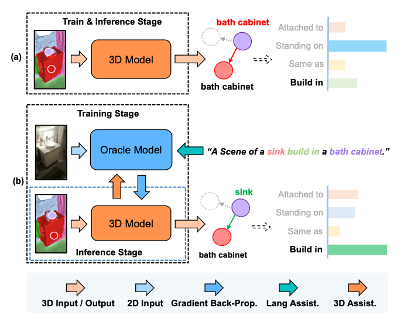

# 点云场景图预测使用说明

# 1. 算法描述

## 算法输入输出
* 算法的输入是带有实例分割标注的三维点云
* 算法的输出是按照置信度排序后的三元组的列表，具体输出格式参考“使用说明”

## 算法介绍
* 整体的算法参考了VLSAT中的知识迁移算法(如下)，以及《SceneGraphFusion: Incremental 3D Scene Graph Prediction from RGB-D Sequences》中的基础网络SGFN
  
* 模型在训练的时候使用了集合了2D和语言信息的多模态知识迁移网络，在推理时仅使用点云就可以达到理想的结果

## 算法搭建库
* 本算法基于Python和Pytorch搭建


# 2. 环境依赖

CUDA版本: 11.3
其他依赖库的安装命令如下：

```bash
conda create -n py38 python=3.8
```

```bash
pip install torch==1.12.1+cu113 torchvision==0.13.1+cu113 torchaudio==0.12.1 --extra-index-url https://download.pytorch.org/whl/cu113
pip install torch-scatter -f https://pytorch-geometric.com/whl/torch-1.12.1+cu113.html
pip install torch-sparse -f https://pytorch-geometric.com/whl/torch-1.12.1+cu113.html
pip install torch-spline-conv -f https://pytorch-geometric.com/whl/torch-1.12.1+cu113.html
pip install torch-geometric
```

# 3. 下载安装

```bash
pip install scene-graph-predictor-pc
```

# 4. 使用说明
```python
import scene_graph_predictor_pc
import trimesh

plydata=trimesh.load('scene/scene0/labels.instances.align.annotated.v2.ply', process=False)
model = scene_graph_predictor_pc.SceneGraphPredictor()
# model 加载数据
model.load('checkpoint')
# 模型预测
res = model.inference(plydata, 10)
# 输出的格式为多个三元组 
[
    {
        'object_id': int,
        'object_class': str,
        'subject_id': int,
        'subject_class': str,
        'relation_class': str,
        'confidence': float
    },
    ...
]
```